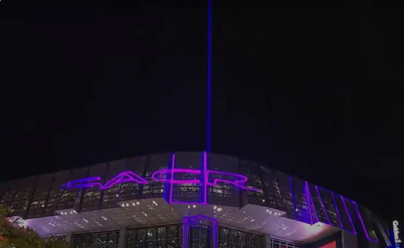

# Intro

**Ryan Goh**

*UCSD Computer Engineering*

>excited to start working on the cse 110 project

`I mostly code in java, but am familiar with python and c++`

Here's a link to my [Github Repository](https://github.com/Rygoh1/cse-110).

Some of my hobbies are
- Watching basketball
- Spending time with family/friends
- Playing video games

3 interesting facts about me are
1. I used to do competitive swimming and swan 20 hrs a week
2. My family is from Singapore
3. I started out Electrical Engineering at UCSD

My other classes are
-[]CSE 110
=[]CSE 101
=[]ECE 109
-[]COGS 108

I don't really have a favorite team, I just support the teams that are fun to watch. This year I'm on the Kings bandwagon.

